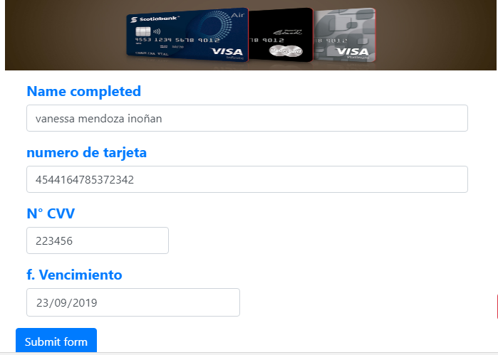

## LibraryCard.js

Creamos una librería que valida un tarjeta de crédito usuando como datos de entrada el nombre del usuario, código de verificacion, fecha de vencimiento y el número de la tarjeta de crédito.Para ello ultilizamos como base el algoritmo de Lhun.
___

### REQUISITOS
Implementar un validador de datos de tarjeta de crédito. La librería debería validar el número de tarjeta de crédito (usando algoritmo de Luhn), fecha de vencimiento, codigo de verificación (cvv) y nombre completo que aparece en la tarjeta.

+ README.md con descripción del módulo, instrucciones de instalación, uso y documentación del API.
index.js: Librería debe exportar una función u objeto al entorno global (window) y hacer uso de features de ES6 donde sea apropiado.
+ index.html: Página web de la librería con ejemplo funcionando.
package.json con nombre, versión, descripción, autores, licencia, dependencias, scripts (pretest, test, ...)
+ .eslintrc con configuración para linter (ver guía de estilo de JavaScript)
+ .gitignore para ignorar node_modules u otras carpetas que no deban incluirse en control de versiones (git).

Hacker edition (opcional):

+ Si la librería está dirigida al navegador, debe adherirse al patrón UMD para poder ser usado con AMD, CommonJS y como variable global del navegador.
Integración continua con Travis o Circle CI

___

### ¿Que es una libreria en JS?
Es un conjunto de implementaciones funcionales, codificadas en un lenguaje de programación, que ofrece una interfaz bien definida para la funcionalidad que se invoca.

### ¿Que es node.js?
Node.js es una librería y entorno de ejecución de E/S dirigida por eventos y por lo tanto asíncrona que se ejecuta sobre el intérprete de JavaScript creado por Google V8.

### ¿Que es el algoritmo de Luhn?
El algoritmo de Luhn es un método creado para la verificación de números de identificación, como los números de las tarjetas de crédito (Visa, MasterCard).

___

### PLANIFICACIÓN

+ Creamos un [tablero][trello] en trello para mantener un registro de las tareas que iremos realizando cada una.

 ___**SEMANA1**___

  + Formamos equipo con mi compañera Yolanda.
  + Elegimos el RETO 1: VALIDADOR DE DATOS DE TARJETAS DE CRÉDITO e hicimos fork al reto modelo
  + Escribimos nuestra primera version de readme de la cual recibimos enriquecedores feedback los cuales ayudaron a mejorar nuestro         trabajo.
  + Aprendimos a crear issues y lo pusimos en practica.
  + Averiguamos sobre node.js y inicializamos nuestro proyecto con npm init y git init
  + Creamos un index.html y comenzamos a maquetar un ejemplo de lo que podria llegar a ser nuestro producto final.
    

  ___**SEMANA2**___

  Implementando funcionalidad anuestra libreria para ello hicimos un trabajo colaborativo en git y nos reunimos el fin de semana y en     las tardes para complementar los conceptos que habiamos averiguado y asi poder ponerlo en practica en la libreria, asi tambien nos       sirvio bastante las clases de fundamentos de javascript.

  ___**SEMANA3**___
   Demo final


### Herramientas Utilizadas

+ ES6
+ HTML5
+ CSS3
+ BOOTSTRAP4
___

### Link de referencias

+ https://www.youtube.com/watch?v=xO_D1y5ywfE
+ https://www.w3schools.com/nodejs/default.asp
+ https://carlosazaustre.es/ecmascript-6-el-nuevo-estandar-de-javascript/
+ https://platzi.com/blog/ecmascript-nueva-sintaxis/

___


* **Track:** _Common Core_
* **Curso:** _JS Deep Dive: Crea tu propia librería usando JavaScript_
* **Unidad:** _Producto final_

***

El plugin debe recibir una referencia a un elemento del DOM que contenga
`<input>`s con los siguientes nombres (atributo `name`):

* `cn` (Card Number): El número de la tarjeta de crédito
* `exp` (Expiry Date): Fecha de expiración
* `cvv` (Card Verification Value): Código de validación de 3 dígitos
* `name`: Nombre completo como aparece en la tarjeta

___

### Ejemplo

```html
<form>
  <div class="form-group">
    <label for="cn">Número de tarjeta</label>
    <input id="cn" name="cn" />
  </div>
  <div class="form-group">
    <label for="exp">Fecha de vencimiento</label>
    <input id="exp" name="exp" />
  </div>
  <div class="form-group">
    <label for="cvv">CVV</label>
    <input id="cvv" name="cvv" />
  </div>
  <div class="form-group">
    <label for="name">Nombre completo</label>
    <input id="name" name="name" />
  </div>
  <input type="submit" value="Pagar" />
</form>
```

```js
const form = document.querySelector('form');

form.addEventListener('submit', (e) => {
  e.preventDefault();
  if (validateCardDetails(form)) {
    console.log('datos válido... enviar...');
  } else {
    console.log('datos inválidos');
  }
});
```

A la hora de hacer las validaciones, la librería debería de añadir la clase
`.error` a los `<input>`s que no pasen la validación, o la clase `.success`
en caso de que sí pase.

### **Autoras**

>##### Yolanda Ventura Chavez
>##### Vanessa Mendoza Inoñan
